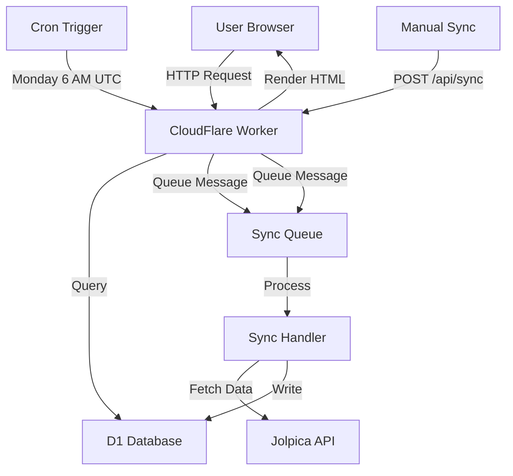

Rear JackMan is a CloudFlare Workers application that tracks Formula 1 race data. The architecture is designed to be simple, text-based, and focused on efficient data fetching and rendering.

## Technology stack

Rear JackMan is built with:

- **CloudFlare Workers** - Serverless edge computing platform
- **CloudFlare D1** - SQLite-based serverless database
- **CloudFlare Queues** - Message queue for background processing
- **TypeScript** - Type-safe JavaScript
- **Jolpica F1 API** - External data source for race information

<Note>
The app is intentionally minimalist with no frontend framework. All HTML is server-rendered with vanilla CSS and minimal JavaScript for interactivity.
</Note>

## Architecture overview

The application has two primary flows as described in the README:

1. **Sync flow** - Background task to fetch data from external sources
2. **Serve flow** - UI rendering to display race data

### High-level architecture



## Sync flow

The sync flow is responsible for fetching race data from the Jolpica F1 API and storing it in the D1 database.

### Sync triggers

There are two ways to trigger a data sync:

1. **Scheduled cron job** - Runs every Monday at 6:00 AM UTC
   - Defined in `wrangler.toml`: `crons = ["0 6 * * MON"]`
   - Automatically syncs the latest completed race
   - Checks if any races have occurred since the last sync

2. **Manual sync endpoint** - `POST /api/sync/:season`
   - Requires `X-Sync-Secret` header for authentication
   - Allows syncing specific rounds with query parameters
   - Example: `/api/sync/2026?from=5&to=10`

### Sync process

When a sync is triggered:

<Steps>
  <Step title="Queue message">
    The worker enqueues a sync message to the `SYNC_QUEUE` with the season and round range:
    
    ```typescript
    await env.SYNC_QUEUE.send({ 
      season, 
      fromRound: lastRound, 
      toRound: lastRound 
    });
    ```
  </Step>

  <Step title="Queue consumer processes message">
    The queue consumer calls `syncSeason()` from `src/sync.ts` to fetch data:
    
    - Fetches race schedule from Jolpica API
    - For each completed race:
      - Fetches race results
      - Fetches driver standings (before/after)
      - Fetches constructor standings (before/after)
    - Implements rate limiting and retry logic
    - Uses 2-second delays between API calls
  </Step>

  <Step title="Data upsert">
    Race data is written to D1 database tables:
    
    - `races` - Race schedule and circuit information
    - `race_entries` - Individual driver results for each race
    - `standings_snapshots` - Championship standings snapshots
  </Step>
</Steps>

<Tip>
The sync process caches the "after" standings from each race to use as the "before" standings for the next race, minimizing API calls.
</Tip>

### Rate limiting and resilience

The sync system includes robust error handling:

- **Exponential backoff** for 429 rate limit errors (5s, 10s, 20s, 40s, 80s)
- **Retry-After header support** to respect API rate limits
- **Maximum 5 retries** before failing
- **Queue retry mechanism** for failed sync jobs

See the [Data sync](/dev/data-sync) page for detailed implementation.

## Serve flow

The serve flow handles HTTP requests and renders HTML pages.

### Request routing

The main worker (`src/worker.ts`) implements a simple router that matches URL patterns:

```typescript
export default {
  async fetch(request: Request, env: Env, ctx: ExecutionContext): Promise<Response> {
    const url = new URL(request.url);
    const segments = url.pathname.replace(/^\//g, '').split('/').filter(Boolean);
    
    // Route matching logic
    if (segments.length === 0) {
      return htmlResponse(renderHome(KNOWN_SEASONS, LATEST_SEASON));
    }
    // ... more routes
  }
}
```

### Available routes

<ParamField path="GET /" type="route">
  **Home page** - List of available seasons
  
  Returns a simple list with the current season marked as "LIVE".
</ParamField>

<ParamField path="GET /:season" type="route">
  **Season list** - All races in a specific season
  
  Example: `/2026` shows all races for the 2026 season with dates and circuits.
</ParamField>

<ParamField path="GET /:season/:round" type="route">
  **Race detail** - Complete race information
  
  Example: `/2026/5` shows Round 5 results, standings, and position changes.
</ParamField>

<ParamField path="GET /driver/:driverId" type="route">
  **Driver profile** - Driver performance across seasons
  
  Example: `/driver/max_verstappen?season=2026`
  
  Shows race-by-race results for the specified driver.
</ParamField>

<ParamField path="GET /constructor/:constructorId" type="route">
  **Constructor profile** - Team performance across seasons
  
  Example: `/constructor/red_bull?season=2026`
  
  Shows all results for both team drivers.
</ParamField>

<ParamField path="POST /api/sync/:season" type="route">
  **Manual sync trigger** - Queue a data sync job
  
  Requires `X-Sync-Secret` header. Supports `from` and `to` query parameters for round ranges.
</ParamField>

### Rendering system

All pages are server-rendered using TypeScript template functions:

1. **Page renderers** in `src/ui/pages/` generate HTML for specific pages
2. **Layout wrapper** in `src/ui/layout.ts` provides the HTML shell
3. **Inline CSS** in `src/ui/styles.ts` for styling
4. **Client script** in `src/ui/client.ts` for interactivity (collapsible sections)

Example render flow:

```typescript
// 1. Query database
const races = await env.DB.prepare(
  'SELECT * FROM races WHERE season = ? ORDER BY round ASC'
).bind(season).all<Race>();

// 2. Render page
return htmlResponse(renderSeasonList(season, races.results));

// 3. Layout wrapper adds HTML structure
function layout(title: string, body: string): string {
  return `<!DOCTYPE html>
<html lang="en">
<head>
  <title>${title} — Rear JackMan</title>
  <style>${css}</style>
</head>
<body>
${body}
<script>${collapseToggleScript}</script>
</body>
</html>`;
}
```

See the [Rendering](/dev/rendering) page for more details.

## Data model

The application uses three main database tables:

- **races** - One row per race with schedule and circuit details
- **race_entries** - One row per driver per race with results
- **standings_snapshots** - Championship standings "before" and "after" each race

<Info>
The "before/after" snapshot approach allows users to see how the championship evolved throughout the season.
</Info>

See the [Database schema](/dev/database-schema) page for the complete schema.

## CloudFlare Workers features

Rear JackMan leverages several CloudFlare Workers features:

### D1 Database

SQLite-based serverless database with:
- SQL migrations in `migrations/` directory
- Automatic replication and backups
- Global edge deployment
- Binding: `env.DB`

### Queues

Message queue for background sync processing:
- Producer binding: `env.SYNC_QUEUE`
- Consumer configuration: `max_batch_size = 1`, `max_batch_timeout = 5`
- Queue name: `rearjackman-sync`

### Cron Triggers

Scheduled execution for automated syncs:
- Schedule: `0 6 * * MON` (Monday 6 AM UTC)
- Checks for completed races and queues sync
- Implements smart logic to only sync latest rounds

### Observability

Logging and monitoring:
- Enabled in `wrangler.toml`
- Invocation logs for all requests
- Console logs for debugging

## Performance considerations

The architecture is optimized for performance:

1. **Edge deployment** - CloudFlare Workers run close to users globally
2. **Minimal JavaScript** - Only 30 lines of client-side JS for collapsible sections
3. **Database indexes** - Indexes on `season`, `round`, and `race_id`
4. **Batch operations** - Database writes use `db.batch()` for efficiency
5. **Collapsible UI** - Large tables show only top 5 by default

## Security

- **Sync endpoint protection** - Requires `SYNC_SECRET` environment variable
- **No user authentication** - App is read-only for end users
- **Rate limiting** - Respects Jolpica API rate limits with exponential backoff
- **Input validation** - Season and round parameters are validated

## Future enhancements

From the README's TODO list:

- Circuit map display on race pages
- Incremental sync (only sync new rounds)
- Resumable sync for large season imports
- RSS news feeds with LLM filtering
- "Interesting Facts" section with AI-generated summaries

## Next steps

<CardGroup cols={2}>
  <Card title="Database schema" icon="database" href="/dev/database-schema">
    Explore the complete database structure
  </Card>
  <Card title="Data sync" icon="arrows-rotate" href="/dev/data-sync">
    Deep dive into the sync implementation
  </Card>
  <Card title="Rendering" icon="palette" href="/dev/rendering">
    Learn about the UI rendering system
  </Card>
  <Card title="Deploy to CloudFlare" icon="cloud" href="/dev/cloudflare-workers">
    Deploy your own instance
  </Card>
</CardGroup>